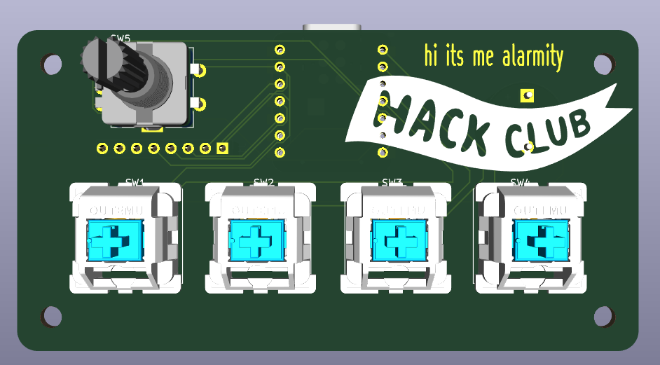
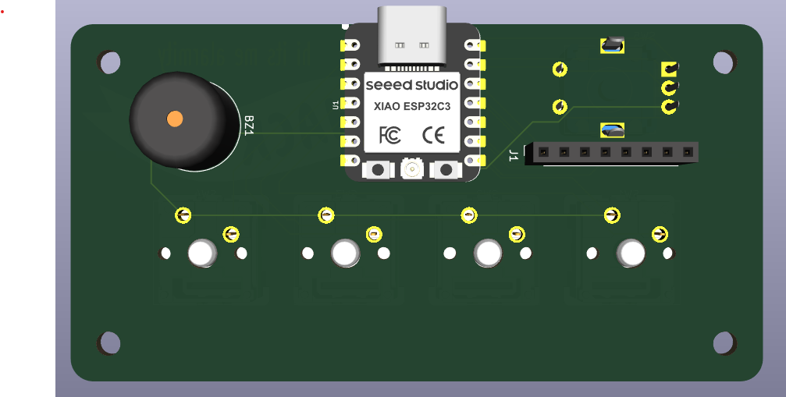

# my alarm clock 
this is an alarm clock using a pcb with an esp32, buzzer and display. the alarm clock also has an enclosure designed in Onshape. to control the alarm clock there are 4 keyswitches and a rotary encoder knob. 

## pcb
front of the pcb

back of the pcb

## cad

