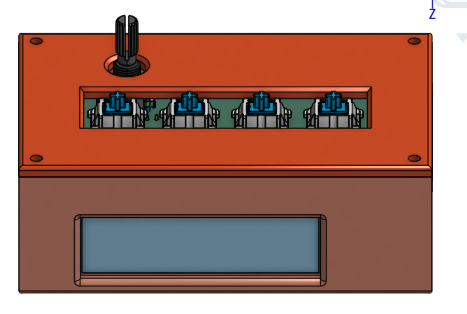
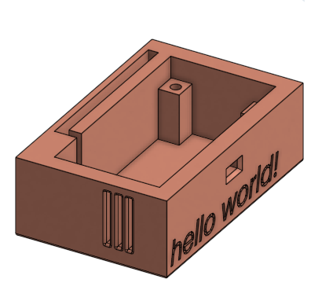
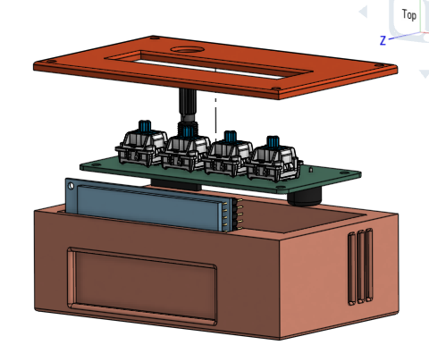
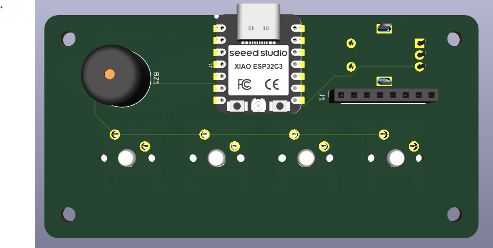
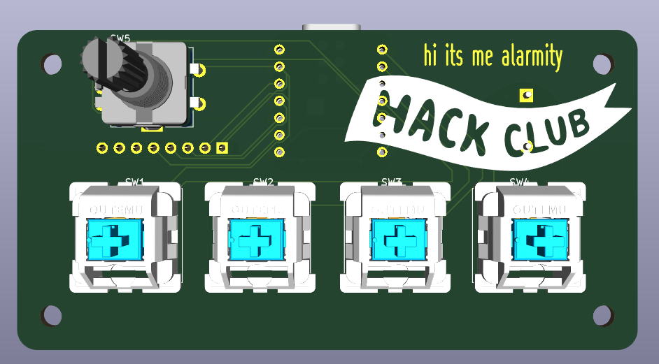
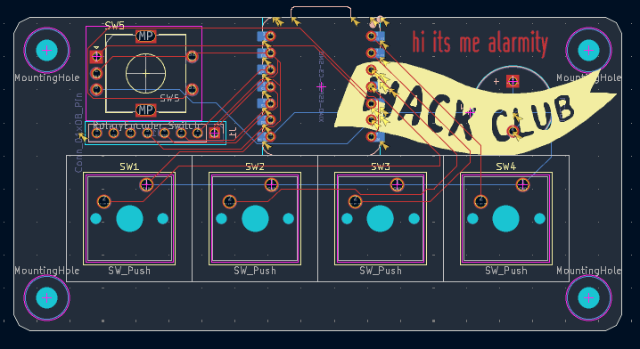
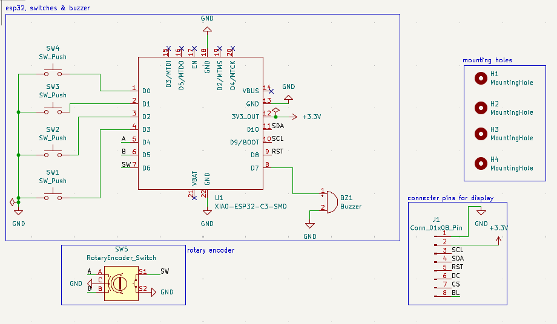

# my alarm clock 
this is an alarm clock using a pcb with an esp32, buzzer and display. the alarm clock also has an enclosure designed in Onshape. to control the alarm clock there are 4 keyswitches and a rotary encoder knob. 

## challenges
for this project, the firmware needed a lot of different variables in order to function like the current time and the alarm time, the pins for the buttons and the different states for buttons, the overall clock and substate fields like setting hours/minutes while setting time. this project really helped me understand how to manage all these by defining functions for checking buttons or checking the time. 

## current features
* set time/alarm
* rotary encoder knob
* loud buzzer when alarm rings

## planned firmware features
* using display instead of serial monitor
* snooze alarm function

## BoM
| components | why/what | 
| ------ | ------ |
| esp32 c3 | microcontroller |
| MX-style keyboard switches | alarm controls | 
| 2.25 in TFT screen | display |
| 3.3v piezo buzzer | beep beep beep |
| 8 pin male header | for more pins |  
| jumper wire | connect display to headers |
| M3x8mm screws | connect case together | 
| rotary encoder knob | set hours/minutes | 

## more pictures
| alarm case | exploded view | back of pcb | front of pcb | pcb design | schematic | 
| ---- | ---- | ---- | ---- | ---- | ---- |
|  |  |  |  |  |  | 
